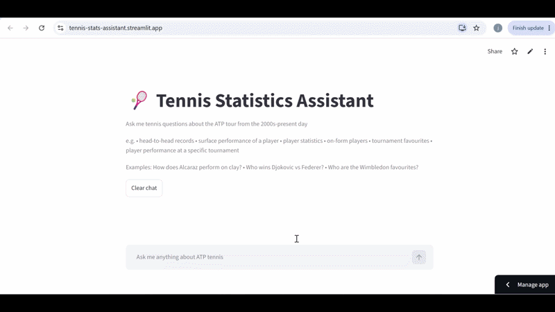
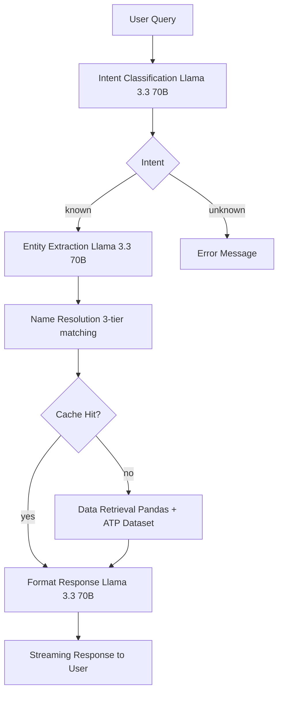

# 🎾 Tennis Statistics Assistant

[](https://tennis-stats-assistant.streamlit.app/)
[](https://python.org)
[](LICENSE)

> A natural language interface for ATP tennis statistics, powered by LLM intent classification and real match data.

**[🎾 Try the Live Demo](https://tennis-stats-assistant.streamlit.app/)**

## Overview

Tennis Statistics Assistant is an AI engineering project that lets users query ATP tennis statistics using natural language. Unlike asking a general AI assistant, this system queries **real, up-to-date match data** updated daily — meaning statistics reflect the current season rather than an AI's training cutoff.

Instead of relying on the LLM to answer from training data (which may be outdated or hallucinated), the system uses a structured pipeline:

1. **LLM classifies the intent** of the user's query
2. **LLM extracts entities** (player names, surfaces, tournaments)
3. **Real match data** is queried from a dataset of 68,000+ ATP matches (2000-present)
4. **LLM formats** the raw data into a natural language response

This approach ensures all statistics are accurate and grounded in real data, eliminating hallucination.

## Live Demo

**[🎾 Try it here](https://tennis-stats-assistant.streamlit.app/)**

Example queries to try:
- *"How does Alcaraz perform on clay?"*
- *"Who wins Djokovic vs Federer?"*
- *"Who are the Wimbledon favourites?"*
- *"Nadal statistics"*
- *"Who is playing well right now?"*
- *"Murray at Roland Garros"*



## Features

- **6 query intents** — head-to-head records, surface performance, player statistics, on-form players, tournament favourites, and player tournament performance
- **Natural language interface** — ask questions conversationally, no specific syntax required
- **Conversation memory** — follow-up questions maintain context e.g. "what about him on clay?" resolves the previous player
- **Streaming responses** — real-time text generation like ChatGPT
- **3-tier name resolution** — handles full names, partial names, misspellings and nicknames
- **Session caching** — repeated queries within a session skip redundant computation
- **Reliable failure handling** — ambiguous player names trigger disambiguation, unknown queries return helpful guidance, rate limits handled gracefully
- **Daily updated data** — statistics reflect current season results

## Tech Stack

- **LLM** — Llama 3.3 70B via Groq API
- **UI** — Streamlit
- **Data** — Pandas
- **Name Matching** — RapidFuzz
- **Language** — Python 3.13

## Architecture



## Technical Decisions

**Structured Queries over RAG**
I considered implementing RAG (Retrieval Augmented Generation) but chose structured pandas queries instead. RAG excels at unstructured document retrieval, but my data is highly structured tabular match data — pandas queries are faster, cheaper, more accurate and fully deterministic. The LLM is used only for natural language understanding and response formatting, never for data retrieval.

**3-Tier Player Name Resolution**
User input like "Djokovic", "Novak Djokovic" or "djokovick" all need to resolve to "Djokovic N." in the dataset. I implemented a 3-tier approach:
1. **Contains search** — fast substring matching for the common case
2. **LLM formatting** — semantic understanding for full names, nicknames and misspellings
3. **Fuzzy matching** — safety net for minor LLM formatting errors (threshold: 90%)

**LLM for Pronoun Resolution**
Follow-up queries like "what about him on clay?" use conversation history passed to the LLM rather than rule-based pronoun resolution. The LLM's semantic understanding handles edge cases like "him", "the Spaniard" or "the world number 1" more reliably than brittle regex rules.

**Clear Intent Boundaries**
Each intent has an explicit description passed to the classifier to avoid ambiguity. For example, `player_stats` is defined as "overall win rate, surface win rates, performance vs ranked opponents, best tournament, recent form" — preventing overlap with `surface_performance` or `tournament_performance`.

**Session-Level Caching**
Results are cached by intent-entity key (e.g. `surface_performance_{'player': 'Alcaraz C.', 'surface': 'Clay'}`) within each user session. This avoids redundant pandas computation for repeated queries while ensuring each user has their own isolated cache.

**Groq + Llama 3.3 70B over OpenAI**
I chose Groq's free tier with Llama 3.3 70B over OpenAI GPT-4o-mini. Llama 3.3 70B is sufficiently capable for intent classification and entity extraction, and Groq's inference speed is significantly faster than OpenAI. The free tier is adequate for a portfolio demo.

**Evaluation Methodology**
Intent classification is evaluated against 104 labelled test cases (34 manual, 70 LLM-generated) spanning 7 intents. Classification is batched in groups of 10 queries per API call for efficiency, reducing evaluation time from ~3 minutes to ~15 seconds. Overall accuracy: **92.3%**.

## How to Run Locally

**Prerequisites:** Python 3.10+

**1. Clone the repository**
```bash
git clone https://github.com/juliannnn21/tennis_llm.git
cd tennis_llm
```

**2. Install dependencies**
```bash
pip install -r requirements.txt
```

**3. Get a Groq API key**
Sign up at [console.groq.com](https://console.groq.com) — free tier is sufficient.

**4. Create a `.env` file**
```
GROQ_API_KEY=your_key_here
```

**5. Download the dataset**
Download the [ATP Tennis 2000-2026 dataset](https://www.kaggle.com/datasets/dissfya/atp-tennis-2000-2023daily-pull) from Kaggle and place the CSV in a `data/` folder:
```
tennis_llm/
└── data/
    └── atp_tennis.csv
```

**6. Run the app**
```bash
streamlit run app.py
```

The app will be available at `http://localhost:8501`

## Data Source

ATP match data sourced from the [ATP Tennis 2000-2026 Daily Update](https://www.kaggle.com/datasets/dissfya/atp-tennis-2000-2023daily-pull) dataset on Kaggle.

- **68,000+ matches** from 2000 to present
- **Daily updates** — reflects current season results
- Covers ATP tour-level matches including Grand Slams, Masters 1000s and ATP 500/250 events
- Key fields: player names, rankings, surfaces, tournament, round, score, winner

Data is not included in this repository — download from the link above and place in `data/atp_tennis.csv`. On Streamlit Cloud the data is downloaded automatically at startup.

*Dataset used under Creative Commons licence — attribution to the dataset author.*

## Future Work

- **API call optimisation** — currently uses 3 LLM calls per query (intent classification, entity extraction, response formatting). These could be reduced to 2 by combining intent classification and entity extraction into a single structured output call, reducing latency and API usage to prevent rate limiting
- **Live entry lists** — integrate ATP entry list API to filter tournament favourites to players actually entered in upcoming tournaments
- **Match outcome predictor** — train a model on historical match data using features already computed (surface win rate, ranking, recent form, H2H record) to predict match winners
- **Extended player statistics** — add current ranking, career titles, finals appearances, ranking points history and peak ranking to player profiles
- **Detailed match statistics** — integrate a dataset with per-match stats (aces, first serve %, break points, winners) to enable deeper statistical analysis beyond win rates
- **More flexible queries** — support multi-surface comparisons, H2H at specific tournaments, and more complex analytical questions
- **WTA support** — extend the pipeline to cover women's tennis using a parallel dataset
- **RAG exploration** — a separate companion project exploring RAG for unstructured tennis data such as match reports and player interviews